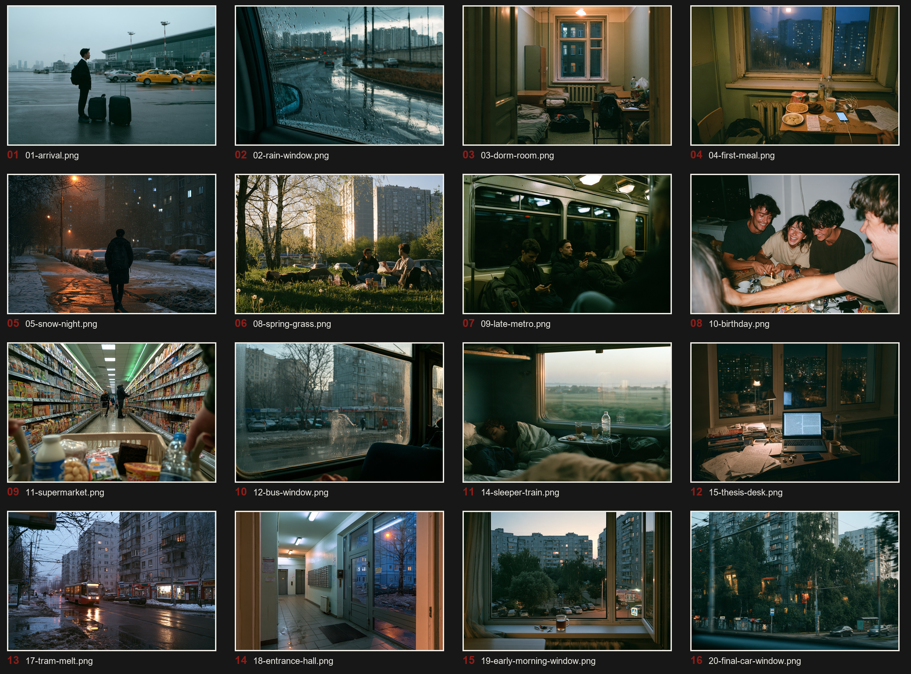

# SEVEN WINTERS

### An AI-generated visual memory of Russia, 2019–2026

> **AIGC Photography · Visual Storytelling · Creative Direction · Digital Zine**

**SEVEN WINTERS** 是一组以 2019–2026 年俄罗斯留学生活为背景的 AIGC 摄影项目。

项目并不试图使用 AI 复刻某一张真实照片，而是尝试重新构建一种更模糊的东西：

> **离开一个地方之后，记忆中的它是什么样子？**

冬天、宿舍、超市、街道、公共交通、住宅区，以及那些没有明确事件发生的普通时刻，共同构成了这组关于俄罗斯生活的合成记忆。

---

## Project Overview

**Project Type**  
AIGC Photography / Visual Storytelling / Digital Zine

**Timeline**  
Russia · 2019–2026

**Primary Tool**  
Midjourney

**Creative Direction**  
Post-Soviet Gloom / Documentary Photography / Everyday Realism

**My Role**  
Concept · Art Direction · Prompt Design · Image Curation · Sequencing · Zine Design

---

# Explore the Project

### 📖 Digital Photobook

Experience **SEVEN WINTERS** as an interactive web-based photography zine.

[**Open Web Photobook →**](https://moscowjiro.github.io/AIGC-photography-seven-winters/seven-winters-zine-v2-reader.html)

### 📕 PDF Edition

View the complete photography book as a PDF.

[**View Photobook PDF →**](output/seven-winters-zine-v2.pdf)

### 🧩 Case Study

Explore the creative process behind the project — from concept and visual direction to prompt iteration, curation and final sequencing.

[**View Case Study →**](https://moscowjiro.github.io/AIGC-photography-seven-winters/case-study.html)

---
# Concept

SEVEN WINTERS 的起点并不是“生成一组俄罗斯风格的照片”。

我更希望重新构造自己对那段生活的视觉记忆。

随着时间过去，很多具体细节已经开始变得模糊。

记忆留下来的往往不是某一天发生了什么，而是：

- 冬天下午很早就暗下来的天空
- 普通住宅楼里的灯光
- 超市和便利店的荧光灯
- 宿舍里的生活痕迹
- 积雪开始融化后的街道
- 公共交通中的沉默
- 城市边缘普通而重复的建筑
- 一个人在异国生活时产生的距离感

因此，这个项目并不是对现实的摄影记录。

它更接近于：

> **A synthetic reconstruction of memory.**

不是记录俄罗斯曾经是什么样子，而是尝试表现——

**多年以后，我是如何记得它的。**

---

# Visual Direction

整个系列围绕一套相对固定的视觉语言进行生成和筛选：

**Post-Soviet atmosphere**  
**Documentary photography**  
**Everyday realism**  
**Muted winter palette**  
**Natural & practical lighting**  
**Imperfect composition**  
**35mm snapshot aesthetics**  
**Quiet observation**

视觉上刻意避免过度商业化、电影化和“AI Art”式的夸张画面。

相比宏大的城市景观，我更关注普通空间：

**Dormitory · Apartment · Supermarket · Street · Metro · Residential Area · Winter Landscape · Transitional Space**

这些日常环境共同构成了 SEVEN WINTERS 的视觉世界。

---

# The Challenge

真正困难的部分并不是生成一张“好看的图片”。

而是：

> **让一组 AI 生成图片看起来属于同一个世界。**

生成过程中出现过很多典型问题。

例如模型很容易把：

```text
Russia
↓
Soviet Union
↓
Old Interior
↓
Snow Everywhere
↓
Brutalist Architecture
```

当作一种固定的视觉联想。

但项目的实际时间背景是：

**2019–2026**

因此我需要不断判断：

**这个场景真的像现代俄罗斯吗？**

**这个宿舍是不是太旧了？**

**这里为什么会出现不合理的积雪？**

**人物是不是太像 AI？**

**画面是不是过度电影化？**

**建筑、商品和生活细节是否符合现实？**

项目因此逐渐从单纯的 Prompt Generation，变成了一个持续的：

> **Generate → Evaluate → Reject → Adjust → Regenerate → Curate**

过程。

---

# AIGC Workflow

SEVEN WINTERS 并不是通过一个固定 Prompt 批量生成。

整个工作流可以概括为：

```text
Personal Experience
        ↓
Concept Definition
        ↓
Visual Research
        ↓
Scene Planning
        ↓
Prompt Design
        ↓
Image Generation
        ↓
Human Evaluation
        ↓
Prompt Iteration
        ↓
Image Curation
        ↓
Sequence Design
        ↓
Zine / Digital Publication
```

其中 AI 主要负责扩大视觉探索空间。

而我主要负责：

**方向、判断、筛选和收敛。**

---

# Human × AI

## AI

Generative AI was used for:

- Image generation
- Visual exploration
- Scene variations
- Composition exploration
- Prompt iteration

## Human

I was responsible for:

- Project concept
- Creative direction
- Visual research
- Scene definition
- Prompt design
- Geographic realism evaluation
- Period accuracy evaluation
- Image selection
- Consistency control
- Narrative sequencing
- Zine direction
- Final presentation

因此，这个项目中的 Human × AI 工作方式可以概括为：

> **AI expands the search space. Human judgement narrows it.**

---

# Curation & Selection

生成并不是项目的终点。

大量候选图片需要经过二次筛选，并重新放回整个系列中进行比较。



主要筛选标准包括：

| Dimension | Question |
| --- | --- |
| Realism | 画面是否具有真实摄影感？ |
| Geography | 场景是否真的像俄罗斯？ |
| Period | 是否符合 2019–2026 的时间背景？ |
| Consistency | 是否属于 SEVEN WINTERS 的视觉体系？ |
| Composition | 构图是否自然，而不是明显 AI 式摆拍？ |
| Narrative | 这张图片是否对整个系列有意义？ |
| Emotion | 是否符合项目整体的情绪基调？ |

即使一张图片本身很好看，如果它破坏整个系列的一致性，也会被删除。

---

# From Images to Story

最终作品并不是按照图片生成顺序排列。

我重新对画面进行编辑和排序，使它们形成一个松散的视觉叙事。

项目的 Storyboard 与 Sequence 分别记录了摄影集的叙事规划和最终图像顺序。

整体情绪更接近：

```text
Arrival
   ↓
Discovery
   ↓
Routine
   ↓
Winter
   ↓
Distance
   ↓
Familiarity
   ↓
Change
   ↓
Departure
   ↓
Memory
```

这一步将项目从：

**AI Image Collection**

进一步转变成：

**Visual Narrative**

---

# Digital Zine

SEVEN WINTERS 最终被整理为一个完整的数字摄影 Zine。

除了静态摄影集之外，项目还制作了独立的 Web Reader，用于模拟数字摄影书的阅读体验。

Repository 中包含：

```text
seven-winters-zine-v2-reader.html
```

用于摄影集阅读体验。

同时包含：

```text
seven-winters-zine-v2-overview.html
```

用于查看整个摄影集的视觉结构与页面组织。

最终摄影集同时输出为 PDF 版本，方便独立阅读和作品集展示。

---

# Case Study

项目同时制作了一份独立 Case Study：

```text
case-study.html
```

Case Study 重点展示的不是最终图片本身，而是整个 AIGC 创作过程：

**Concept → Visual Direction → Generation → Evaluation → Curation → Sequencing → Publication**

它用于解释：

- 为什么选择这个主题
- 如何建立视觉规则
- 如何判断 AI 输出
- 如何处理生成模型的视觉偏差
- 如何筛选图片
- 如何建立系列一致性
- 如何把独立图片组织成摄影叙事

---

# Project Structure

```text
AIGC-photography-seven-winters/
│
├── README.md
│
├── case-study.html
├── case-study.css
│
├── seven-winters-zine-v2-reader.html
├── seven-winters-zine-v2-overview.html
│
├── seven-winters-v2-contact-sheet.jpg
├── seven-winters-v2-storyboard.md
├── sequence.json
│
├── pages.js
└── zine.css
```

### Key Files

**`seven-winters-zine-v2-reader.html`**  
Digital Zine 阅读页面

**`seven-winters-zine-v2-overview.html`**  
摄影集整体视觉 Overview

**`case-study.html`**  
完整 AIGC 创作 Case Study

**`seven-winters-v2-storyboard.md`**  
摄影集叙事与页面规划

**`sequence.json`**  
最终图片 Sequence 数据

**`seven-winters-v2-contact-sheet.jpg`**  
作品筛选与整体视觉检查 Contact Sheet

---

# What I Learned

## 01 · Generation is cheap. Selection is not.

AI 可以快速生成大量视觉上成立的图片。

真正困难的是判断：

> **哪些图片值得留下。**

---

## 02 · Consistency requires a system.

系列一致性不能只依赖重复一个 Prompt。

地理、年代、建筑、人物、光线、摄影语言、色彩和情绪都需要被控制在一个相对稳定的视觉边界内。

---

## 03 · Domain knowledge improves AI output.

一张图片可以非常漂亮，但依然是错的。

如果不知道一个真实的俄罗斯宿舍、超市、住宅区或冬季街道应该是什么样子，就很难判断 AI 输出是否合理。

因此，现实经验本身也成为了 Prompt 与 AI Evaluation 的一部分。

---

## 04 · AI changes the role of the creator.

当生成本身越来越快，创作者的价值开始更多地转移到：

**Concept**

**Taste**

**Direction**

**Evaluation**

**Curation**

**Narrative**

AI 提供更多可能性，而人决定什么值得留下。

---

# Skills Demonstrated

**AIGC**

**Prompt Design**

**Creative Direction**

**Art Direction**

**Visual Storytelling**

**Image Curation**

**Consistency Control**

**Human × AI Workflow**

**Digital Zine Design**

---

# Tools

**Midjourney · Adobe Photoshop · Generative AI Tools · Digital Publishing Workflow**

---

# AI Disclosure

All photographic images in **SEVEN WINTERS** are AI-generated.

The project does not present these images as documentary photographs or records of real events.

They are fictional visual reconstructions informed by personal experience, visual research and creative direction.

---

# Disclaimer

SEVEN WINTERS is an independent personal AIGC visual project created for creative research and portfolio presentation.

---

## SEVEN WINTERS

**An AI-generated visual memory of Russia, 2019–2026.**

*Concept · Creative Direction · Prompt Design · Curation · Visual Storytelling*

© 2026
